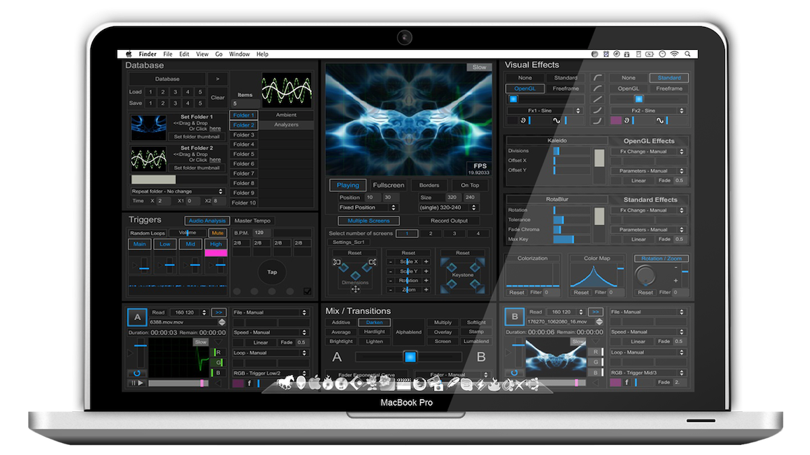

# VJ Mode 1.5

## Description

**VJ Mode** is a software application that has been developed to assist artists and visualists creating and automating content for **audiovisual performances**. The program has a vast amount of tools and features implemented to easily and efficiently control all necessary processes needed for a complete show. The user may select the working material needed (videos, generated visuals, effects) utilising an intuitive storage and selection of files and folders, and set selections and transition modes between events and even configure automatic settings for their interpolations.

[Video Demo](https://youtu.be/tHwt0yMuaNc)

**VJ Mode** includes an audio analysis engine that can control parameters instantly linked to the visual processing, or utilise a range of control methods available (i.e. time-based, random, and so on). Pre-installed VFX units allow the user to achieve impressive visual outcomes, with the opportunity to upgrade the current effects database (FreeFrame). Other basic features include a real-time audio visualiser that displays a number of different visual-styled waveforms, multiscreen support with up to four screens, total control of the output screens (size, position, keystone, etc), and communication with internal and external hardware and software devices with MIDI, OSC, and TouchOSC protocols.

## System Details
* Works up to Max 7 (32 bit)
* Supported resolutions include VGA, SVGA, HD, and HDMI * Supported video formats include .mov, .mpeg, .mpeg4, .avi
* Multi-screen projection (up to four screens)
* Keystone correction for projection surfaces (3D mapping)
* Full automation for every function
* Realtime Audio analysis
* Flexible effects engine with many presets
* Expandable Freeframe plugins support
* Preset settings for instant use
* Control multiple files and folders simultaneously
* Resize videos to output resolution
* Automatically restore last settings
* Save and manage multiple presets
* Record output video
* MIDI control
* OSC control
* iPhone control (TouchOSC)
* Remote Control application
* M4L Collection Plugins for Ableton Live 8

### Minimum System Requirements
* Mac OSX, Windows XP
* 2GB RAM or higher
* Latest Quicktime player installed
* PC: ATI Radeon 9600 or later. NVIDIA GeForce FX 5200 or later
* Mac: Intel Processor

### Recommendations
* The program works best with .mov video files (codec Motion JPEG, saved at 80% quality)
* Video file resolution from 320×240 to 1024×768
